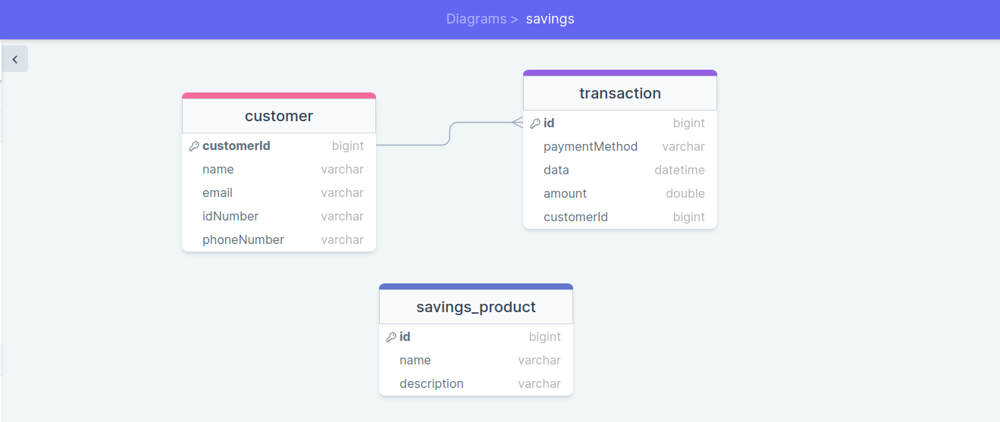

# savings-system

1. Implementing endpoints to capture a list of customers, including their bio data
   (names, ID number, phone number, email, member number, etc).
- Testing Customer Endpoint `/api/customers`

2. Implementing endpoints to record savings transactions per customer, including
   transaction details such as transaction ID, date, payment method, and amount.
3. Implementing endpoints to track the total savings amount for each person.
4. Implementing endpoints to track the total savings amount received across all users.
- Testing Transaction Endpoint `/api/transactions/**`

5. Implementing endpoints to create and manage multiple savings products, such as
   Education Savings, Personal Savings, and Vacation Savings.
- Testing Savings Product Endpoint `/api/savings-products/**`

## Swagger Documentation URL
 - Access it at after running the project  `http://localhost:8080/swagger-ui/index.html`
